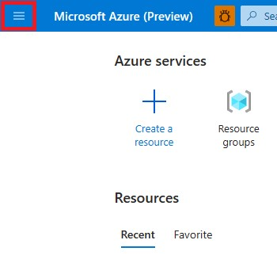
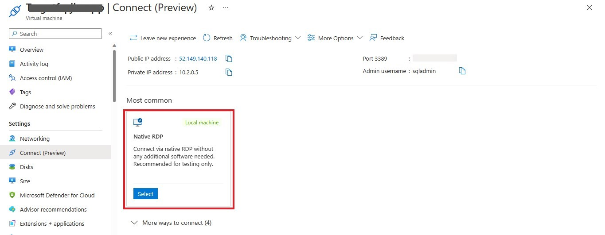
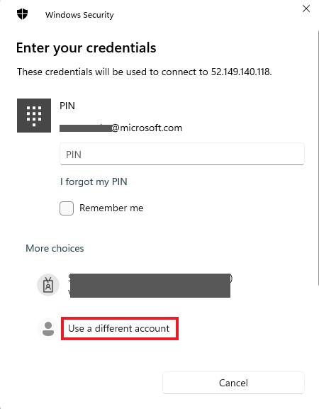
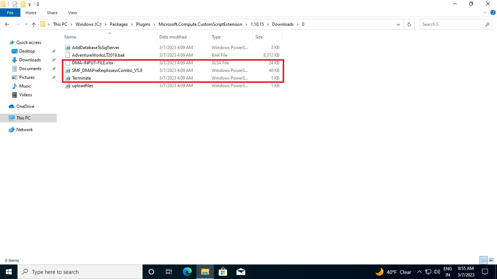
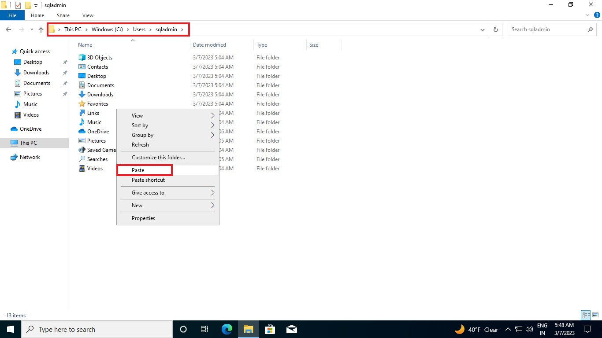

# DMA Assessment

## DMA Assessments to migrate to Azure SQL Database(s)

   

## Learning Objectives

This lab step is to provide the detailed procedure/step to use the **Data Migration Assistant (DMA)** automation script (```SMF_DMAPreReqAssessCombo_V5.8.ps1```) to detect/assess the following issues in on-premise SQL Servers:

- Migration blocking issues: 
    - To discover the compatibility issues that block migrating on-premises SQL Server database(s) to Azure SQL Database
    - To discover the compatibility issues that block migrating on-premises SQL Server database(s) to Azure SQL Managed Instance
    - To discover the compatibility issues that block migrating on-premises SQL Server database(s) to SQL Server on Azure Virtual Machines 
- And to initiate & terminate the data-collection process for the target SKU assessment.

## Prerequisites for DMA Assessment

- Virtual Machine - Already setup for you.
- Software & PowerShell module:
    - .NET Core 3.1.28
    - .NET Framework 4.8
    - Microsoft® Data Migration Assistant v5.6
    - ImportExcel  
- Input Excel File - The DMA automation script is based on the worksheet named ‘DMA-INPUT-FILE.xlsx’ and following columns in worksheet of the Input Excel file:

Column Name | Note
------------- | -------------
Computer Name | SQL Server Name (e.g. 01SQLDEV001)
SQL Server Instance Name | SQL Server Instance Name (e.g. MSSQLSERVER)
SQL Server Product Name | SQL Server Product Name (e.g. Microsoft SQL Server 2016)
Authentication type | Authentication type (e.g. either Windows Authentication or SQL Server Authentication)
DBUserName | Database User Name (e.g. sa) in case of SQL Server Authentication. User must be member of the SQL Server sysadmin role
DBPassword | Database User Password (e.g. Password123) in case of SQL Server Authentication
DBPort | Database Port (e.g. 1433)

## Exercise 1: Setup and connect to virtual machine via RDP

1. Go to **Azure portal** and click on hamburger button ☰ on top-left side and select **Resource groups**. Select the resource group deployed in the Azure Portal. Amongst the list of resources, open the **virtual machine** starting with name ```Target{*}```.

    
    
    
    
    

2. Click on **Connect** and then click **Select** to connect via native RDP. Click **Download RDP file** to the download.

    
    
    
    
    

3. Go to **Downloads** folder in your local system. Open the RDP file. Then select **Connect**.

    
    
    

4. Click on **More choices** and then select **use a different account**. Enter ```sqladmin``` as Email address and ```Mail@123``` as Password. Click **Ok**. And Select **Yes** to verify the certificate.
    
    
    
    
    
    
    
    

5. Now you are inside **virtual machine**.

    

## Exercise 2: Setup powershell scripts and input excel file for DMA assessment

1. Click on **File Explorer** present in Taskbar at the bottom. Go to ```C:\Packages\Plugins\Microsoft.Compute.CustomScriptExtension\1.10.15\Downloads\0``` path. This folder contains ```DMA-INPUT-FILE.xlsx```, ```SMF_DMAPreReqAssessCombo_V5.8.ps1``` and ```Terminate.ps1```.

    
    
    

2. Select these files and right-click on the mouse and select **Copy** or press **Ctrl + C**.

    

3. Now go to ```C:\Users\sqladmin``` path and right-click on the mouse and select **Paste** or press **Ctrl + V** to paste the files in this folder.

    
    
    

4. Search for ```Office``` in Search bar and open it.

5. Sign into **MS office** using your lab credentials.

6. Select **Upload and open** option to open ```DMA-INPUT-FILE``` file. It will be opened in the browser.

7. You need to edit this excel file by changing ```Computer Name```, ```DBUserName``` and ```DBPassword``` columns. 

8. **DBUserName** should be ```sqladmin``` and  **DBPassword** should be ```Mail@123```.

9. To get the **Computer name**, go to your resource group and copy the virtual machine name starting with ```Source{*}```. And paste it in the excel replacing **localhost**.

10. Select **File** and then **Save As** and click **Download a copy**. 

11. Go to **Downloads** folder in virtual machine and copy the excel and replace it with existing ```DMA-INPUT-FILE```. Please make sure that the file name should not be changed.

## Exercise 3: Run DMA assessment powershell script

1. Right click on ```SMF_DMAPreReqAssessCombo_V5.8.ps1``` and select **Run with powershell** to run the powershell script.

2. Now **Windows powershell** will open and ask for your input.

3. Give ```2``` as value and hit enter to run DMA Assessment.

> Note: .Net 4.8, .Net Core and DMA are required for this assessment.  

4. **.Net 4.8** is already available in the virtual machine. So, it will ask for your input to install **DMA**. Enter ```Y```.

5. Once DMA is installed, it will ask for your input to install **.Net Core**. Enter ```Y```.

6. After all the requirements are installed, DMA assessment will run and store the output in ```C:\Users\sqladmin\output``` folder.

7. Again you need to run the script to perform data gathering. Right click on ```SMF_DMAPreReqAssessCombo_V5.8``` and select **Run with powershell**.

8. Give ```3``` as input to select perform data gathering.

9. Enter ```Y``` to run the data gathering step.

10. Enter ```0```  for Days and Hours value.

11. It will perform data gathering and stores the output files in ```C:\Users\sqladmin\output\PerfData``` folder.


