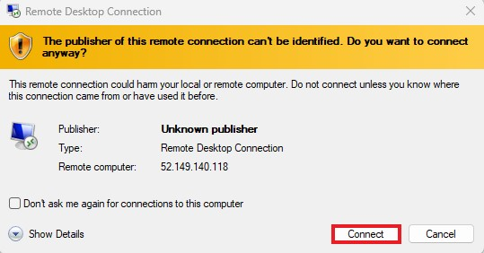
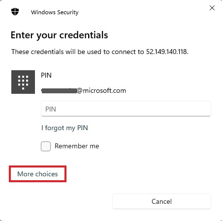

# DMA Assessment

1. Go to **Azure portal** and click on hamburger button ☰ on top-left side and select **Resource groups**. Select the resource group deployed in the Azure Portal. Amongst the list of resources, open the **virtual machine** starting with name ```Target{*}```.

    
    
    
    
    

2. Click on **Connect** and then click **Select** to connect via native RDP. Click **Download RDP file** to the download.

    
    
    
    
    

3. Go to **Downloads** folder in your local system. Open the RDP file. Then select **Connect**.

    
    
    

4. Click on **More choices** and then select **use a different account**. Enter ```sqladmin``` as Email address and ```Mail@123``` as Password. Click **Ok**. And Select **Yes** to verify the certificate.
    
    
    
    
    
    
    
    

5. Now you are inside **virtual machine**. Go to ```C:\Packages\Plugins\Microsoft.Compute.CustomScriptExtension\1.10.15\Downloads\0``` path in vm file manager.

6. Select three files with names: ```DMA-INPUT-FILE```, ```SMF_DMAPreReqAssessCombo_V5.8``` and ```Terminate``` and right click and select **Copy**.

7. Now go to ```C:\Users\sqladmin``` path and right click and select **Paste**. It will copy-paste three files into the folder.

8. Search for ```Office``` in Search bar and open it.

9. Sign into **MS office** using your lab credentials.

10. Select **Upload and open** option to open ```DMA-INPUT-FILE``` file. It will be opened in the browser.

11. You need to edit this excel file by changing ```Computer Name```, ```DBUserName``` and ```DBPassword``` columns. 

12. **DBUserName** should be ```sqladmin``` and  **DBPassword** should be ```Mail@123```.

13. To get the **Computer name**, go to your resource group and copy the virtual machine name starting with ```Source{*}```. And paste it in the excel replacing **localhost**.

14. Select **File** and then **Save As** and click **Download a copy**. 

15. Go to **Downloads** folder in virtual machine and copy the excel and replace it with existing ```DMA-INPUT-FILE```. Please make sure that the file name should not be changed.

16. Right click on ```SMF_DMAPreReqAssessCombo_V5.8``` and select **Run with powershell** to run the powershell script.

17. Now **Windows powershell** will open and ask for your input.

18. Give ```2``` as value and hit enter to run DMA Assessment.

> Note: .Net 4.8, .Net Core and DMA are required for this assessment.  

19. **.Net 4.8** is already available in the virtual machine. So, it will ask for your input to install **DMA**. Enter ```Y```.

20. Once DMA is installed, it will ask for your input to install **.Net Core**. Enter ```Y```.

21. After all the requirements are installed, DMA assessment will run and store the output in ```C:\Users\sqladmin\output``` folder.

22. Again you need to run the script to perform data gathering. Right click on ```SMF_DMAPreReqAssessCombo_V5.8``` and select **Run with powershell**.

23. Give ```3``` as input to select perform data gathering.

24. Enter ```Y``` to run the data gathering step.

25. Enter ```0```  for Days and Hours value.

26. It will perform data gathering and stores the output files in ```C:\Users\sqladmin\output\PerfData``` folder.


