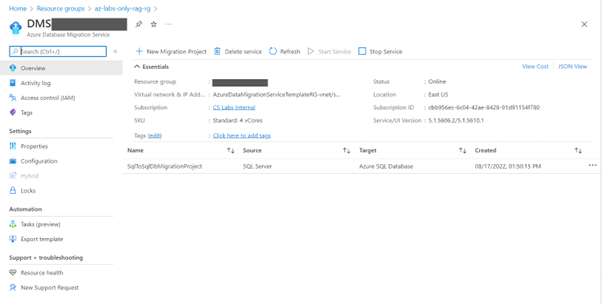
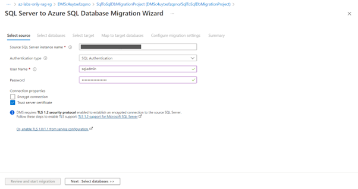
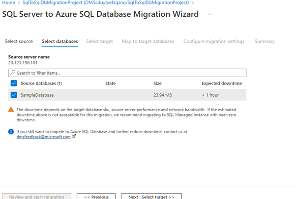
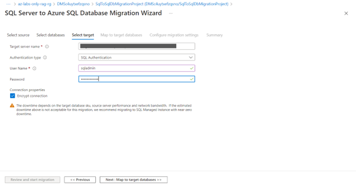
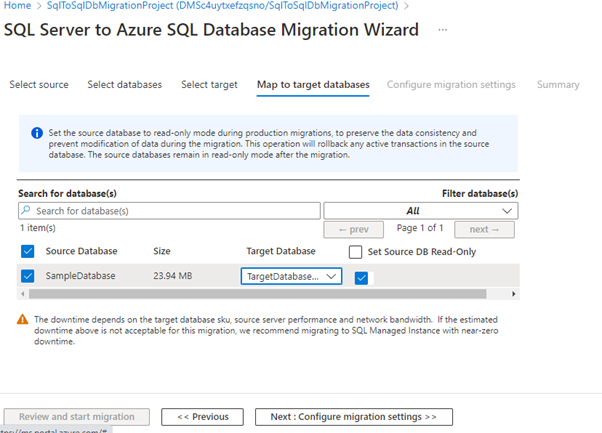
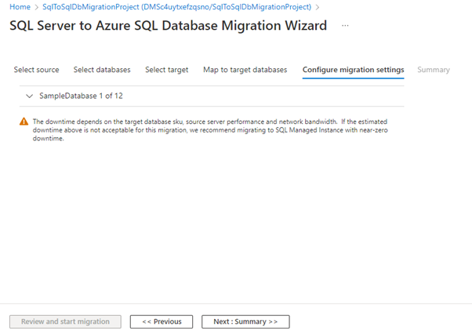
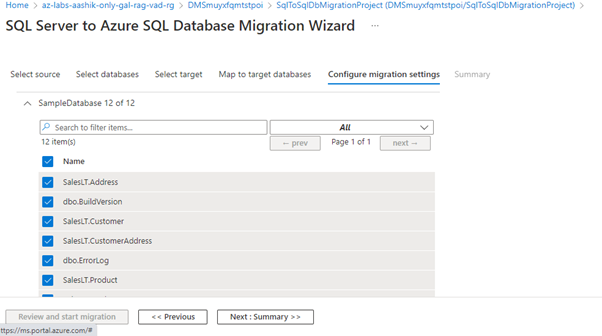
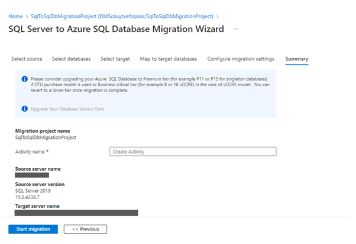
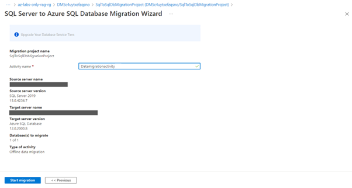
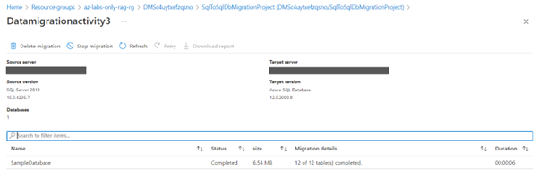

# Performing the Data Migration

## Introduction

In this lab step you will perform the data migration from the source SQL Server instance to the target Azure SQL Database using Azure Data Migration Service.

## Instructions

1. In the Azure portal menu, select **All services**. Search for and select **Azure Database Migration Services**. OR Inside the newly created Resource Group, Search for and select **Azure Database Migration Services**.

2. On the Azure Database Migration Services screen, select the **Azure Database Migration Service** instance that you created.

    

3. Select **SqlToSqlDbMigrationProject**.

4. Select **New Activity**.

    

5. Select **Data Migration**.

### Specify source details

1. On the **Select source** screen, specify the connection details for the source SQL Server instance. (IP Address: 20.237.235.148)

2. Enter **User Name**: sqladmin and **Password**: Password@123 and ensure **Trust server certificate** is checked:

    

3. Select **Next: Select databases**.

### Select databases for migration

1. Select Sample database that you want to migrate to Azure SQL Database. Review the expected downtime.

2. Select **Next: Select target**.

    

### Specify target details

1. On the **Select target** screen, provide authentication settings to your Azure SQL Database.

2. Provide **Target server name**: targetservernamesjlkt4djbbjr4.database.windows.net, **SQL Username**: sqladmin and **Password**: Password@123

    

3. Select Next: Map to target databases screen, map the source and the target database for migration.

4. Ensure that the **Target Database** has been set and check the box to **Set Source DB Read-Only**.
If the target database contains the same database name as the source database, Azure Database Migration Service selects the target database by default.
Setting the source database read-only preserves data consistency at the expense of not allowing writes to the source database.

    

5. Select **Next: Configuration migration settings** to advance to the next step. Azure Database Migration Service auto selects all the empty source tables that exist on the target Azure SQL Database instance. If you want to re migrate tables that already include data, you need to explicitly select the tables on this blade. In the context of this lab, all the tables are empty at this point so all of them are selected.

    

6. Expand **SampleDatabase** to see all Tables in this Database.

    

7. Select **Next: Summary**, review the migration configuration and in the **Activity name** text box, specify a name for the migration activity.

    

8. Give **Activity name**:   Datamigrationactivity

    
   
### Run the migration

1. Select **Start migration**. The migration activity window appears, and the **Status** of the activity is **pending**.

    

### Monitor the migration

1. On the migration activity screen, select Refresh to update the display until the Status of the migration shows as Completed.

    

> Troubleshooting Tip: If the above migration fails to successfully migrate all of the tables, you can re-perform the data migration activity again targeting only the tables that failed.

