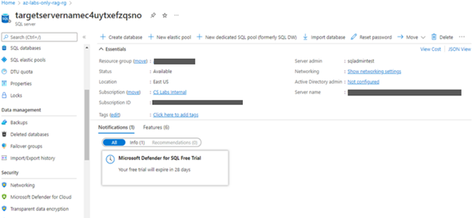
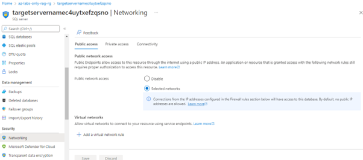
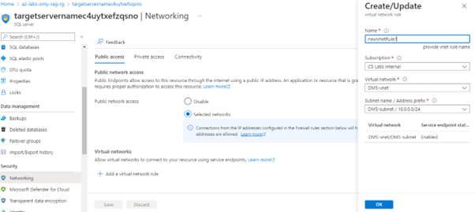
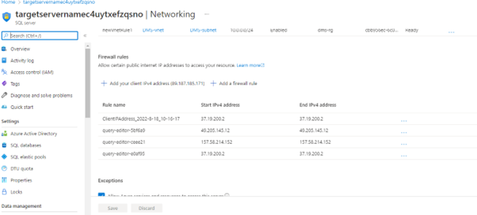
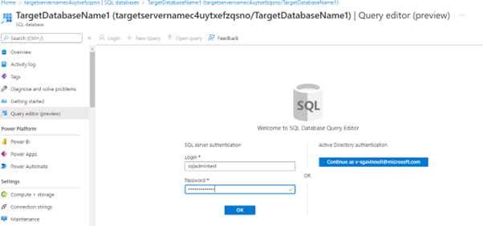

# Validating the Database Migration

## Introduction

You will manually validate all of the table data has been migrated to the target Azure SQL Database using the Query Editor in this lab step.

## Instructions

1. Check Target SQL Server Networking Firewall rules and add your client IP address like below.
Open the target SQL Server Overview.



2. Navigate to the Networking on the left side blade.



3. Select Add a virtual network rule


4. Leave the default values and click OK



5. Under Firewall rules, click + Add your client IPv4 address followed by Save:



6. Then Select Query editor and provide SQL Credentials to run SQL commands:
- Login: Enter sqladmin
- Password: Enter Password@123



7. Execute below SQL Query: 

``` SQL
select schema_name(tab.schema_id) + '.' + tab.name as [table],
sum(part.rows) as [rows] from sys.tables tab        
inner join sys.partitions part on tab.object_id = part.object_id
where part.index_id IN (1, 0)
group by schema_name(tab.schema_id) + '.' + tab.name
order by sum(part.rows) desc
```

Please validate the output matches the following expected values:

```
table, rows
SalesLT.Customer, 847
SalesLT.ProductDescription, 762
SalesLT.ProductModelProductDescription, 762
SalesLT.SalesOrderDetail, 542
SalesLT.Address, 450
SalesLT.CustomerAddress, 417
SalesLT.Product, 295
SalesLT.ProductModel, 128
SalesLT.ProductCategory, 41
SalesLT.SalesOrderHeader, 32
dbo.BuildVersion, 1
dbo.ErrorLog, 0
```

## Summary
You have now validated the migration of the database into Azure SQL Database after having performed the schema and data migration activities. 

To learn more about migrating from SQL Server to Azure SQL Database refer to the official documentation[https://learn.microsoft.com/en-ca/azure/dms/tutorial-sql-server-to-azure-sql].

